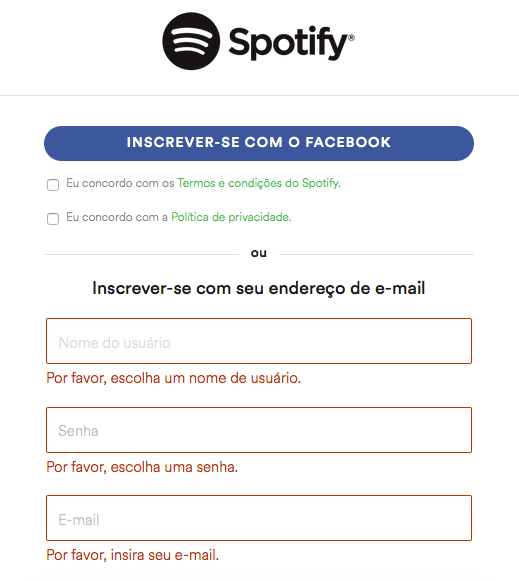
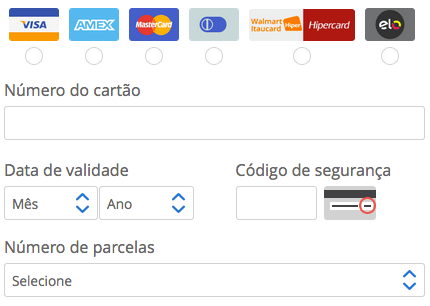

# Engenharia de Software

We see three critical differences between programming and software engineering: time, scale, and the trade-offs at play. On a software engineering project, engineers need to be more concerned with the passage of time and the eventual need for change. In a software engineering organization, we need to be more concerned about scale and efficiency, both for the software we produce as well as for the organization that is producing it. Finally, as software engineers, we are asked to make more complex decisions with higher-stakes outcomes, often based on imprecise estimates of time and growth.

A diferença entre programação e engenharia de software se baseia em três aspectos principais: engenheiros de software se preocupam mais com tempo e adaptação futura, lidam com escala e eficiência organizacional, e enfrentam decisões complexas de alto impacto, mesmo com incertezas. Essas diferenças refletem a natureza estratégica da engenharia de software em comparação com a programação focada na implementação técnica.

Within Google, we sometimes say, “Software engineering is programming integrated over time.” Programming is certainly a significant part of software engineering: after all, programming is how you generate new software in the first place. If you accept this distinction, it also becomes clear that we might need to delineate between programming tasks (development) and software engineering tasks (development, modification, maintenance). The addition of time adds an important new dimension to programming. Cubes aren’t squares, distance isn’t velocity. Software engineering isn’t programming.

O trecho enfatiza que a engenharia de software não se resume à programação, mas inclui a dimensão do tempo e o desenvolvimento contínuo do software. A analogia usada ilustra como essa diferença é fundamental. O autor ressalta a necessidade de reconhecer as diversas tarefas envolvidas, como desenvolvimento, modificações e manutenção. Em suma, a engenharia de software vai além da programação ao incorporar a evolução do software ao longo do tempo.

## Trade-Offs

Um "trade-off" na engenharia de computação se refere a uma situação em que é preciso tomar uma decisão entre duas ou mais opções, sabendo que ao escolher uma delas, você estará abrindo mão de certos benefícios oferecidos pela outra opção. Em outras palavras, é uma troca entre vantagens e desvantagens.

#### Exemplos de Trade-Offs

*Custo vs. Desempenho: Escolher componentes de hardware mais avançados geralmente resulta em melhor desempenho, mas também pode aumentar significativamente o custo do sistema. Encontrar um ponto intermediário entre custo e desempenho é um trade-off importante em projetos de hardware.

*Velocidade de Desenvolvimento vs. Qualidade: Em muitos projetos, existe uma pressão para entregar resultados rapidamente. No entanto, investir mais tempo no desenvolvimento pode resultar em um produto de melhor qualidade. O trade-off aqui é entre lançar rapidamente algo funcional e polir mais o produto antes de lançá-lo.

*Desempenho vs. Consumo de Recursos: Você pode precisar decidir entre otimizar o desempenho de um software ou sistema, o que pode exigir mais recursos de computação (como CPU e memória), versus otimizar o consumo de recursos em prol da eficiência energética ou da economia de custos.

## As 10 Heurísticas de Usabilidade para Design de Interface de Usuário

Criadas por Jakob Nielsen e Rolf Molich em 1990. São um conjunto de diretrizes amplamente reconhecidas para avaliar a usabilidade de interfaces de usuário em produtos digitais, como sites, aplicativos e software em geral. Elas fornecem critérios que podem ajudar a identificar problemas de usabilidade e melhorar a experiência do usuário.

#### 1° Visibilidade do Status do Sistema
Consiste em deixar o usuário informados sobre o que acontece no momento da iteração, com o sistema traxendo feedbacks instantâneos que servem para informar o status da iteração, além de conduzir pra os próximos passos.
##### Exemplo
Quando estamos assitindo a um vídeo no youtube nos é apresentado em uma seção lateral videos correspondentes aquele que estamos assitindo e os proximos a serem exibidos e  quais foram assistidos ou não.

https://www.youtube.com/watch?v=jvVRoPwG2AU&t=106s
#### 2° Correspondência Entre o Sistema e o Mundo Real
Com relação ao mundo real pode-se considerar sons, visual e o tom de escrita que o usuário utiliza para se comunicar. è comunmente implementada quando se utiliza setas, ícones e a cor vermelha para representar algo negaativo ou errado na maioria das vezes.
um softwere que comunmente usa essa heurística é o phothoshop emm sua barra de ferramentas.

#### 3° Liberdade e Controle do Usuário
Nessa heurística a principal preocupação é de passar para o usuário a liberdade de ele fazer o que quiser dentro do sistema com exceção das regras que interferem em outra funcionalidade ou são prejudiciais e regras que vão contra o negócio.
por exemplo, quando criamos um post no twitter temos a lierdade de apaga-lo, oculta-lo. Só não consegue alterar o twitter em si.

#### 4° Consistência e Padrões
é  parte visual do sistema que coniste em padrões que possam se rapidamente reconhecidos pelo usário. Para que isso ocorra é necessário seguir alguns requisitos, como:
* Padronização e cores;
* Uso de grupo tipográfico específico;
* Escolha de imagens e vetores a partir de um padrão;
* Cracterísticas de botões e links.
  
Deve ser construído um guia de estilo que facilite a criação de novos ambientes mantendo o padrão já desenhado. Podemos observar essa heurística com facilidade nas redes sociais. Se você acessa o Instagram, percebe rapidamente em qual mídia está e nota o quanto ela é diferente do Facebook, por exemplo.

#### 5° Prevenção de Erros
Procurar sempre especificar o tipo de erro cometido, aplicar auto complete ou sugerir complementos.
ter uma interface que não permita o usuario errar.
um exemplo sao os mecanisos de busca do google, no momento em que começamos a digitar ele ja oferece uma forma de completar a busca e mesmo com a ortografia errada ele busca e pergunta se está correta a resposta.

#### 6° Reconhecer ao Invéz de Lembrar
O usuário não tem obrigação de decorar qual foi o caminho que ele fez pra chegar até a página.

Por exemplo, quando você entra em um produto do site da Locaweb é disponibilizado o caminho que você fez pra chegar até ele. Nós chamamos isso de breadcrumb.

#### 7° Flexibilidade e Eficiência

A flexibilidade e eficiência são heurísticas que se complementam. A flexibilidade é a capacidade de o usuário escolher o caminho que ele quer seguir, enquanto a eficiência é a capacidade de o usuário fazer o que ele quer fazer de forma rápida.

#### 8° Estética e Design Minimalista

A estética e o design minimalista são heurísticas que se complementam. A estética é a capacidade de o usuário achar o sistema bonito, enquanto o design minimalista é a capacidade de o usuário achar o sistema simples.

#### 9° Auxiliar Usuários s Reconhecer, Diagnosticar e Recuperar erros
As mensagens de erros tem que ser claras e o mais proximas possíveis do conteudo ou ação que as causou.
No formulário de cadastro do Spotify,por exemplo, caso você não preencha os dados necessários ele deixa  claro quais campos faltantes, com uma mensagem clara e objetiva.

#### 10° Ajuda e Documentação
Ofereça acesso fácil a informações de suporte, como documentação, tutoriais ou assistência online, para que os usuários possam encontrar ajuda quando necessário.

Essas heurísticas são um guia valioso para avaliar a usabilidade de um sistema de software ou interface de usuário e são frequentemente usadas por designers e especialistas em usabilidade para melhorar a qualidade das interações do usuário com sistemas digitais.

## Diagrama UML

Um diagrama UML é uma representação gráfica de um sistema ou parte dele, usando uma linguagem padronizada chamada Linguagem Unificada de Modelagem. Existem vários tipos de diagramas UML, que podem mostrar diferentes aspectos do sistema, como sua estrutura, comportamento ou implantação. Um dos diagramas mais comuns é o diagrama de classes, que mostra as classes, atributos, operações e relações entre os objetos de um sistema. 

#### Exemplo de um diagrama UML

 

## Diagrama de Classes UML

